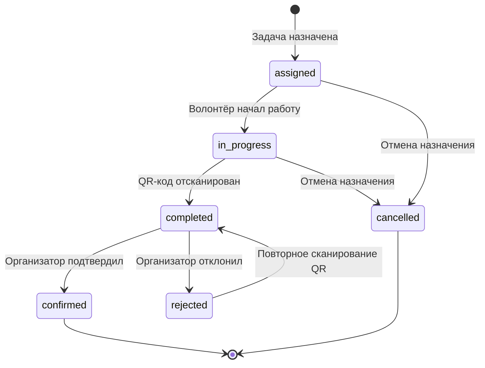

# Дизайн: Система верификации выполнения задач

## Overview

Система верификации выполнения задач предоставляет механизм подтверждения выполнения волонтёрских задач через сканирование QR-кодов. Система включает генерацию криптографически защищённых QR-кодов, их сканирование волонтёрами на месте выполнения задачи, и последующую верификацию организаторами с возможностью оставления отзывов и оценок.

### Ключевые возможности

- **Генерация QR-кодов**: Создание уникальных криптографически подписанных QR-кодов для каждой задачи
- **Сканирование**: Мобильное сканирование QR-кодов волонтёрами с валидацией подписи
- **Управление статусами**: Отслеживание жизненного цикла выполнения задачи (assigned → in_progress → completed → confirmed/rejected)
- **Верификация**: Подтверждение или отклонение выполнения задач организаторами с обратной связью
- **Оценка работы**: Система рейтингов и отзывов для мотивации волонтёров
- **Уведомления**: Автоматические уведомления при изменении статусов
- **Аналитика**: Статистика по верификации задач для организаторов

### Технологический стек

- **Backend**: Next.js 15 API Routes
- **Database**: PostgreSQL через Prisma ORM
- **QR Generation**: библиотека `qrcode`
- **QR Scanning**: библиотека `html5-qrcode`
- **Cryptography**: Node.js `crypto` (HMAC-SHA256)
- **Frontend**: React компоненты

## Architecture

### Архитектурная диаграмма

```mermaid
graph TB
    subgraph "Frontend Layer"
        VOL[Волонтёр UI]
        ORG[Организатор UI]
    end
    
    subgraph "Component Layer"
        QRGen[QRCodeGenerator]
        QRScan[QRCodeScanner]
        VerPanel[TaskVerificationPanel]
        History[TaskHistoryList]
        Rating[RatingAndFeedback]
    end
    
    subgraph "API Layer"
        GenAPI[POST /api/tasks/[id]/generate-qr]
        GetAPI[GET /api/tasks/[id]/qr]
        ScanAPI[POST /api/tasks/[id]/scan]
        StartAPI[POST /api/task-assignments/[id]/start]
        ConfirmAPI[POST /api/task-assignments/[id]/confirm]
        RejectAPI[POST /api/task-assignments/[id]/reject]
        VerAPI[GET /api/organizer/verifications]
        HistAPI[GET /api/volunteer/task-history]
    end
    
    subgraph "Service Layer"
        QRService[QR Service]
        CryptoService[Crypto Service]
        NotifService[Notification Service]
        StatService[Statistics Service]
    end
    
    subgraph "Data Layer"
        DB[(PostgreSQL)]
    end
    
    VOL --> QRScan
    VOL --> History
    ORG --> QRGen
    ORG --> VerPanel
    ORG --> Rating
    
    QRGen --> GenAPI
    QRGen --> GetAPI
    QRScan --> ScanAPI
    History --> HistAPI
    VerPanel --> VerAPI
    VerPanel --> ConfirmAPI
    VerPanel --> RejectAPI
    Rating --> ConfirmAPI
    
    GenAPI --> QRService
    GetAPI --> QRService
    ScanAPI --> QRService
    ScanAPI --> CryptoService
    
    StartAPI --> NotifService
    ConfirmAPI --> NotifService
    ConfirmAPI --> StatService
    RejectAPI --> NotifService
    
    QRService --> DB
    CryptoService --> DB
    NotifService --> DB
    StatService --> DB
```

### Архитектурные принципы

1. **Разделение ответственности**: Чёткое разделение между генерацией QR-кодов, их валидацией и бизнес-логикой верификации
2. **Безопасность**: Криптографическая защита QR-кодов с использованием HMAC-SHA256 и секретного ключа
3. **Масштабируемость**: Stateless API endpoints, позволяющие горизонтальное масштабирование
4. **Отказоустойчивость**: Graceful degradation при недоступности сервисов уведомлений
5. **Аудит**: Логирование всех попыток сканирования и изменений статусов

## Components and Interfaces

### Backend Components

#### 1. QR Service

**Ответственность**: Генерация и валидация QR-кодов

```typescript
interface QRService {
  // Генерирует QR-код для задачи
  generateQRCode(taskId: string, projectId: string): Promise<{
    qrCodeData: string;      // Base64 PNG
    qrCodePayload: string;   // JSON payload
    generatedAt: Date;
  }>;
  
  // Валидирует QR-код
  validateQRCode(qrCodePayload: string): {
    isValid: boolean;
    taskId?: string;
    projectId?: string;
    generatedAt?: Date;
    error?: string;
  };
  
  // Проверяет срок действия QR-кода
  isQRCodeExpired(generatedAt: Date): boolean;
}
```

**Реализация**:
- Использует библиотеку `qrcode` для генерации PNG изображений
- Формат payload: `{taskId, projectId, timestamp, signature}`
- Signature: HMAC-SHA256(taskId + projectId + timestamp, SECRET_KEY)
- Срок действия: 90 дней

#### 2. Crypto Service

**Ответственность**: Криптографические операции

```typescript
interface CryptoService {
  // Создаёт HMAC-SHA256 подпись
  createSignature(data: string): string;
  
  // Проверяет HMAC-SHA256 подпись
  verifySignature(data: string, signature: string): boolean;
  
  // Генерирует безопасный токен
  generateSecureToken(): string;
}
```

**Реализация**:
- Использует Node.js `crypto` модуль
- Секретный ключ хранится в `process.env.QR_SECRET_KEY`
- Алгоритм: HMAC-SHA256

#### 3. Notification Service

**Ответственность**: Отправка уведомлений пользователям

```typescript
interface NotificationService {
  // Отправляет уведомление о начале работы
  notifyTaskStarted(taskAssignmentId: string): Promise<void>;
  
  // Отправляет уведомление о выполнении
  notifyTaskCompleted(taskAssignmentId: string): Promise<void>;
  
  // Отправляет уведомление о подтверждении
  notifyTaskConfirmed(taskAssignmentId: string): Promise<void>;
  
  // Отправляет уведомление об отклонении
  notifyTaskRejected(taskAssignmentId: string, reason: string): Promise<void>;
  
  // Отправляет уведомление об оценке
  notifyRatingReceived(taskAssignmentId: string): Promise<void>;
}
```

**Реализация**:
- Использует существующий `/api/email/send` endpoint
- Создаёт in-app уведомления (будущая функциональность)
- Timeout: 30 секунд

#### 4. Statistics Service

**Ответственность**: Сбор и расчёт статистики

```typescript
interface StatisticsService {
  // Получает статистику по проекту
  getProjectStatistics(projectId: string): Promise<ProjectStatistics>;
  
  // Обновляет счётчики волонтёра
  updateVolunteerCounters(volunteerId: string): Promise<void>;
  
  // Экспортирует статистику в CSV
  exportStatisticsCSV(projectId: string): Promise<string>;
}

interface ProjectStatistics {
  totalAssigned: number;
  totalCompleted: number;
  totalConfirmed: number;
  totalRejected: number;
  avgTimeToComplete: number;      // в часах
  avgTimeToConfirm: number;       // в часах
  confirmationRate: number;       // процент
  topVolunteers: Array<{
    volunteerId: string;
    name: string;
    confirmedTasks: number;
  }>;
}
```

### API Endpoints

#### POST /api/tasks/[id]/generate-qr

**Назначение**: Генерация QR-кода для задачи

**Авторизация**: Организатор (владелец проекта)

**Request**:
```typescript
// Параметры URL
params: {
  id: string; // Task ID
}
```

**Response**:
```typescript
{
  qrCode: string;        // Base64 PNG изображение
  qrCodePayload: string; // JSON payload для отладки
  generatedAt: string;   // ISO timestamp
}
```

**Бизнес-логика**:
1. Проверить, что пользователь - организатор проекта
2. Проверить, что задача существует
3. Сгенерировать QR-код с подписью
4. Сохранить QR-код и timestamp в базу данных
5. Вернуть QR-код

**Коды ошибок**:
- 401: Не авторизован
- 403: Не владелец проекта
- 404: Задача не найдена
- 500: Ошибка генерации

#### GET /api/tasks/[id]/qr

**Назначение**: Получение существующего QR-кода

**Авторизация**: Организатор (владелец проекта)

**Request**:
```typescript
params: {
  id: string; // Task ID
}
```

**Response**:
```typescript
{
  qrCode: string;        // Base64 PNG
  generatedAt: string;   // ISO timestamp
  expiresAt: string;     // ISO timestamp (generatedAt + 90 дней)
}
```

#### POST /api/tasks/[id]/scan

**Назначение**: Сканирование QR-кода волонтёром

**Авторизация**: Волонтёр (назначенный на задачу)

**Request**:
```typescript
params: {
  id: string; // Task ID
}

body: {
  qrCodePayload: string; // Декодированный JSON из QR-кода
}
```

**Response**:
```typescript
{
  success: boolean;
  message: string;
  taskAssignment: {
    id: string;
    status: string;
    completedAt: string;
  };
}
```

**Бизнес-логика**:
1. Проверить авторизацию волонтёра
2. Декодировать и валидировать QR-код
3. Проверить криптографическую подпись
4. Проверить срок действия (90 дней)
5. Проверить, что задача назначена этому волонтёру
6. Проверить, что статус "assigned" или "in_progress"
7. Обновить статус на "completed"
8. Записать completedAt
9. Отправить уведомление организатору
10. Логировать попытку сканирования

**Коды ошибок**:
- 401: Не авторизован
- 400: Недействительный QR-код
- 400: QR-код устарел
- 403: Задача не назначена вам
- 400: Неверный статус задачи
- 429: Слишком много неудачных попыток
- 500: Ошибка сервера

#### POST /api/task-assignments/[id]/start

**Назначение**: Начало работы над задачей

**Авторизация**: Волонтёр (назначенный на задачу)

**Request**:
```typescript
params: {
  id: string; // TaskAssignment ID
}
```

**Response**:
```typescript
{
  success: boolean;
  taskAssignment: {
    id: string;
    status: "in_progress";
    startedAt: string;
  };
}
```

**Бизнес-логика**:
1. Проверить, что пользователь - волонтёр
2. Проверить, что назначение принадлежит волонтёру
3. Проверить, что статус "assigned"
4. Обновить статус на "in_progress"
5. Записать startedAt
6. Отправить уведомление организатору

#### POST /api/task-assignments/[id]/confirm

**Назначение**: Подтверждение выполнения задачи организатором

**Авторизация**: Организатор (владелец проекта)

**Request**:
```typescript
params: {
  id: string; // TaskAssignment ID
}

body: {
  rating?: number;    // 1-5, опционально
  feedback?: string;  // до 1000 символов, опционально
}
```

**Response**:
```typescript
{
  success: boolean;
  taskAssignment: {
    id: string;
    status: "confirmed";
    confirmedAt: string;
    rating?: number;
    feedback?: string;
  };
}
```

**Бизнес-логика**:
1. Проверить, что пользователь - организатор проекта
2. Проверить, что назначение существует
3. Проверить, что статус "completed"
4. Валидировать rating (1-5) и feedback (до 1000 символов)
5. Обновить статус на "confirmed"
6. Записать confirmedAt, rating, feedback
7. Увеличить completedTasks волонтёра
8. Проверить, все ли назначения задачи завершены
9. Если да, обновить статус задачи на "completed"
10. Отправить уведомление волонтёру
11. Обновить статистику

#### POST /api/task-assignments/[id]/reject

**Назначение**: Отклонение выполнения задачи организатором

**Авторизация**: Организатор (владелец проекта)

**Request**:
```typescript
params: {
  id: string; // TaskAssignment ID
}

body: {
  rejectionReason: string; // 10-500 символов, обязательно
}
```

**Response**:
```typescript
{
  success: boolean;
  taskAssignment: {
    id: string;
    status: "rejected";
    rejectionReason: string;
  };
}
```

**Бизнес-логика**:
1. Проверить, что пользователь - организатор проекта
2. Проверить, что назначение существует
3. Проверить, что статус "completed"
4. Валидировать rejectionReason (10-500 символов)
5. Обновить статус на "rejected"
6. Сохранить rejectionReason
7. Отправить уведомление волонтёру с причиной
8. Логировать отклонение

#### GET /api/organizer/verifications

**Назначение**: Панель верификации для организатора

**Авторизация**: Организатор

**Request**:
```typescript
query: {
  projectId?: string;     // фильтр по проекту
  status?: string;        // фильтр по статусу
  sortBy?: string;        // "completedAt" | "createdAt"
  sortOrder?: string;     // "asc" | "desc"
  page?: number;
  limit?: number;
}
```

**Response**:
```typescript
{
  assignments: Array<{
    id: string;
    task: {
      id: string;
      title: string;
      projectId: string;
      projectTitle: string;
    };
    volunteer: {
      id: string;
      firstName: string;
      lastName: string;
      avatarUrl?: string;
    };
    status: TaskAssignmentStatus;
    completedAt?: string;
    confirmedAt?: string;
    startedAt?: string;
    rating?: number;
    feedback?: string;
    rejectionReason?: string;
  }>;
  pagination: {
    total: number;
    page: number;
    limit: number;
    totalPages: number;
  };
  pendingCount: number; // количество со статусом "completed"
}
```

#### GET /api/volunteer/task-history

**Назначение**: История задач волонтёра

**Авторизация**: Волонтёр

**Request**:
```typescript
query: {
  status?: string;        // фильтр по статусу
  sortBy?: string;        // "completedAt" | "createdAt"
  sortOrder?: string;     // "asc" | "desc"
  page?: number;
  limit?: number;
}
```

**Response**:
```typescript
{
  assignments: Array<{
    id: string;
    task: {
      id: string;
      title: string;
      description: string;
      projectId: string;
      projectTitle: string;
    };
    status: TaskAssignmentStatus;
    createdAt: string;
    startedAt?: string;
    completedAt?: string;
    confirmedAt?: string;
    rating?: number;
    feedback?: string;
    rejectionReason?: string;
  }>;
  pagination: {
    total: number;
    page: number;
    limit: number;
    totalPages: number;
  };
}
```

### Frontend Components

#### 1. QRCodeGenerator

**Назначение**: Генерация и отображение QR-кода для организатора

**Props**:
```typescript
interface QRCodeGeneratorProps {
  taskId: string;
  onGenerated?: (qrCode: string) => void;
}
```

**Функциональность**:
- Кнопка "Сгенерировать QR-код"
- Отображение QR-кода после генерации
- Кнопка "Скачать QR-код"
- Кнопка "Печать QR-кода"
- Отображение даты генерации и срока действия
- Индикатор загрузки

#### 2. QRCodeScanner

**Назначение**: Сканирование QR-кода волонтёром

**Props**:
```typescript
interface QRCodeScannerProps {
  taskId: string;
  onScanSuccess: (result: ScanResult) => void;
  onScanError: (error: string) => void;
}
```

**Функциональность**:
- Доступ к камере устройства
- Сканирование QR-кода через html5-qrcode
- Отображение превью камеры
- Индикатор сканирования
- Обработка ошибок (недействительный QR, устаревший QR, не ваша задача)
- Кнопка "Отмена"

#### 3. TaskVerificationPanel

**Назначение**: Панель верификации для организатора

**Props**:
```typescript
interface TaskVerificationPanelProps {
  projectId?: string;
}
```

**Функциональность**:
- Список выполненных задач
- Фильтры (проект, статус)
- Сортировка (дата выполнения, дата создания)
- Счётчик задач, ожидающих проверки
- Кнопки "Подтвердить" и "Отклонить"
- Модальное окно для ввода причины отклонения
- Пагинация

#### 4. TaskHistoryList

**Назначение**: История задач волонтёра

**Props**:
```typescript
interface TaskHistoryListProps {
  volunteerId: string;
}
```

**Функциональность**:
- Список всех задач волонтёра
- Фильтр по статусу
- Сортировка по дате
- Отображение статуса, даты, оценки
- Детальный просмотр задачи
- Отображение причины отклонения
- Пагинация

#### 5. RatingAndFeedback

**Назначение**: Форма оценки и отзыва

**Props**:
```typescript
interface RatingAndFeedbackProps {
  taskAssignmentId: string;
  onSubmit: (rating?: number, feedback?: string) => void;
}
```

**Функциональность**:
- Выбор оценки (1-5 звёзд)
- Текстовое поле для отзыва (до 1000 символов)
- Валидация
- Кнопка "Сохранить"
- Возможность оставить только оценку или только отзыв

## Data Models

### Изменения в Prisma Schema

#### 1. Обновление модели Task

```prisma
model Task {
  id                  String     @id @default(uuid()) @db.Uuid
  projectId           String     @map("project_id") @db.Uuid
  title               String     @db.VarChar(255)
  description         String
  requiredSkillId     String?    @map("required_skill_id") @db.Uuid
  requiredVolunteers  Int        @map("required_volunteers")
  currentVolunteers   Int        @default(0) @map("current_volunteers")
  deadline            DateTime   @db.Date
  status              TaskStatus @default(pending)
  createdAt           DateTime   @default(now()) @map("created_at") @db.Timestamp(6)
  
  // НОВЫЕ ПОЛЯ для QR-кодов
  qrCode              String?    @map("qr_code") @db.Text  // Base64 PNG
  qrCodeGeneratedAt   DateTime?  @map("qr_code_generated_at") @db.Timestamp(6)

  project      Project          @relation(fields: [projectId], references: [id], onDelete: Cascade)
  skill        Skill?           @relation(fields: [requiredSkillId], references: [id])
  assignments  TaskAssignment[]
  applications Application[]

  @@map("tasks")
}
```

#### 2. Обновление модели TaskAssignment

```prisma
model TaskAssignment {
  id               String                 @id @default(uuid()) @db.Uuid
  taskId           String                 @map("task_id") @db.Uuid
  volunteerId      String                 @map("volunteer_id") @db.Uuid
  assignedBy       String                 @map("assigned_by") @db.Uuid
  status           TaskAssignmentStatus   @default(assigned)
  completedAt      DateTime?              @map("completed_at") @db.Timestamp(6)
  confirmedAt      DateTime?              @map("confirmed_at") @db.Timestamp(6)
  feedback         String?
  rating           Int?
  createdAt        DateTime               @default(now()) @map("created_at") @db.Timestamp(6)
  
  // НОВЫЕ ПОЛЯ
  startedAt        DateTime?              @map("started_at") @db.Timestamp(6)
  rejectionReason  String?                @map("rejection_reason") @db.VarChar(500)

  task      Task @relation(fields: [taskId], references: [id], onDelete: Cascade)
  volunteer User @relation("VolunteerAssignments", fields: [volunteerId], references: [id], onDelete: Cascade)
  assigner  User @relation("AssignedBy", fields: [assignedBy], references: [id])

  @@unique([taskId, volunteerId])
  @@map("task_assignments")
}
```

#### 3. Новая модель QRCodeScanLog

```prisma
model QRCodeScanLog {
  id          String   @id @default(uuid()) @db.Uuid
  taskId      String   @map("task_id") @db.Uuid
  userId      String   @map("user_id") @db.Uuid
  success     Boolean
  errorReason String?  @map("error_reason") @db.VarChar(255)
  scannedAt   DateTime @default(now()) @map("scanned_at") @db.Timestamp(6)
  ipAddress   String?  @map("ip_address") @db.VarChar(45)

  @@index([userId, scannedAt])
  @@index([taskId])
  @@map("qr_code_scan_logs")
}
```

### Миграция базы данных

```sql
-- Добавление полей в таблицу tasks
ALTER TABLE tasks 
ADD COLUMN qr_code TEXT,
ADD COLUMN qr_code_generated_at TIMESTAMP(6);

-- Добавление полей в таблицу task_assignments
ALTER TABLE task_assignments
ADD COLUMN started_at TIMESTAMP(6),
ADD COLUMN rejection_reason VARCHAR(500);

-- Создание таблицы для логов сканирования
CREATE TABLE qr_code_scan_logs (
  id UUID PRIMARY KEY DEFAULT gen_random_uuid(),
  task_id UUID NOT NULL,
  user_id UUID NOT NULL,
  success BOOLEAN NOT NULL,
  error_reason VARCHAR(255),
  scanned_at TIMESTAMP(6) NOT NULL DEFAULT CURRENT_TIMESTAMP,
  ip_address VARCHAR(45)
);

CREATE INDEX idx_qr_scan_logs_user_time ON qr_code_scan_logs(user_id, scanned_at);
CREATE INDEX idx_qr_scan_logs_task ON qr_code_scan_logs(task_id);
```

### Обновление enum TaskAssignmentStatus

Текущий enum уже содержит все необходимые статусы:
```prisma
enum TaskAssignmentStatus {
  assigned      // Назначена
  completed     // Выполнена (отсканирован QR)
  confirmed     // Подтверждена организатором
  rejected      // Отклонена организатором
  cancelled     // Отменена
}
```

Добавим новый статус для отслеживания начала работы:

```prisma
enum TaskAssignmentStatus {
  assigned      // Назначена
  in_progress   // В процессе выполнения (НОВЫЙ)
  completed     // Выполнена (отсканирован QR)
  confirmed     // Подтверждена организатором
  rejected      // Отклонена организатором
  cancelled     // Отменена
}
```

### Диаграмма состояний TaskAssignment



### Структура QR-кода

QR-код содержит JSON payload следующего формата:

```typescript
interface QRCodePayload {
  taskId: string;
  projectId: string;
  timestamp: number;      // Unix timestamp генерации
  signature: string;      // HMAC-SHA256
}
```

**Процесс генерации подписи**:
```typescript
const data = `${taskId}:${projectId}:${timestamp}`;
const signature = crypto
  .createHmac('sha256', process.env.QR_SECRET_KEY!)
  .update(data)
  .digest('hex');
```

**Процесс валидации**:
```typescript
const data = `${payload.taskId}:${payload.projectId}:${payload.timestamp}`;
const expectedSignature = crypto
  .createHmac('sha256', process.env.QR_SECRET_KEY!)
  .update(data)
  .digest('hex');
const isValid = expectedSignature === payload.signature;
```

## Correctness Properties

*Свойство (property) — это характеристика или поведение, которое должно выполняться для всех допустимых выполнений системы. По сути, это формальное утверждение о том, что должна делать система. Свойства служат мостом между человекочитаемыми спецификациями и машинно-проверяемыми гарантиями корректности.*

### Property 1: QR-код содержит полную структуру данных

*Для любого* сгенерированного QR-кода, декодированный payload ДОЛЖЕН содержать все обязательные поля: taskId, projectId, timestamp и signature.

**Validates: Requirements 1.2, 11.3**

### Property 2: Криптографическая подпись round-trip

*Для любых* данных задачи (taskId, projectId, timestamp), сгенерированная HMAC-SHA256 подпись ДОЛЖНА успешно проходить валидацию с тем же секретным ключом.

**Validates: Requirements 1.3, 2.3, 11.1**

### Property 3: Подпись с неправильным ключом отклоняется

*Для любого* QR-кода, подпись сгенерированная с одним секретным ключом НЕ ДОЛЖНА проходить валидацию с другим секретным ключом.

**Validates: Requirements 11.1, 2.4**

### Property 4: QR-код уникален для каждой задачи

*Для любых* двух различных задач, сгенерированные QR-коды ДОЛЖНЫ быть уникальными (иметь разные payload или signature).

**Validates: Requirements 1.1**

### Property 5: QR-код формат и размер

*Для любого* сгенерированного QR-кода, изображение ДОЛЖНО быть в формате PNG и иметь разрешение не менее 300x300 пикселей.

**Validates: Requirements 1.6**

### Property 6: Персистентность QR-кода round-trip

*Для любого* сгенерированного QR-кода, сохранение в базу данных и последующее чтение ДОЛЖНО вернуть идентичные данные (qrCode и qrCodeGeneratedAt).

**Validates: Requirements 1.4**

### Property 7: Декодирование QR-кода round-trip

*Для любых* данных (taskId, projectId, timestamp, signature), кодирование в QR-код и последующее декодирование ДОЛЖНО вернуть исходные данные.

**Validates: Requirements 2.2**

### Property 8: Валидация срока действия QR-кода

*Для любого* QR-кода с timestamp менее 90 дней назад, валидация срока действия ДОЛЖНА пройти успешно. Для QR-кодов с timestamp более 90 дней назад, валидация ДОЛЖНА провалиться с ошибкой "QR-код устарел".

**Validates: Requirements 11.4, 11.5**

### Property 9: Сканирование изменяет статус на completed

*Для любой* задачи со статусом "assigned" или "in_progress", назначенной данному волонтёру, успешное сканирование валидного QR-кода ДОЛЖНО изменить статус на "completed".

**Validates: Requirements 2.5**

### Property 10: Сканирование отклоняется для неназначенных волонтёров

*Для любого* волонтёра, которому задача не назначена, попытка сканирования QR-кода ДОЛЖНА быть отклонена с ошибкой "Эта задача не назначена вам".

**Validates: Requirements 2.6**

### Property 11: Запись timestamp при изменении статуса

*Для любого* изменения статуса на "completed", поле completedAt ДОЛЖНО быть установлено в текущее время (с точностью до 1 секунды). Аналогично, для изменения на "confirmed", поле confirmedAt ДОЛЖНО быть установлено.

**Validates: Requirements 2.7, 5.3**

### Property 12: State transition корректность

*Для любой* задачи, переходы состояний ДОЛЖНЫ следовать допустимым путям:
- assigned → in_progress → completed → confirmed
- assigned → in_progress → completed → rejected → completed
- assigned → cancelled
- in_progress → cancelled

Недопустимые переходы (например, assigned → confirmed) ДОЛЖНЫ быть отклонены.

**Validates: Requirements 3.2, 5.2, 6.4, 12.3**

### Property 13: Увеличение счётчика выполненных задач

*Для любого* подтверждения задачи (статус → confirmed), счётчик completedTasks волонтёра ДОЛЖЕН увеличиться ровно на 1.

**Validates: Requirements 5.5**

### Property 14: Агрегация статусов задачи

*Для любой* задачи с несколькими assignments, когда все assignments имеют статус "confirmed" ИЛИ "cancelled", статус самой задачи ДОЛЖЕН автоматически измениться на "completed".

**Validates: Requirements 5.6**

### Property 15: Валидация длины причины отклонения

*Для любой* строки длиной менее 10 или более 500 символов, валидация причины отклонения ДОЛЖНА провалиться. Для строк длиной от 10 до 500 символов включительно, валидация ДОЛЖНА пройти успешно.

**Validates: Requirements 6.3**

### Property 16: Персистентность причины отклонения

*Для любой* валидной причины отклонения, сохранение в базу данных и последующее чтение ДОЛЖНО вернуть идентичную строку.

**Validates: Requirements 6.5**

### Property 17: Повторное сканирование после отклонения

*Для любой* задачи со статусом "rejected", повторное сканирование валидного QR-кода ДОЛЖНО быть разрешено и изменить статус обратно на "completed".

**Validates: Requirements 6.7, 13.2**

### Property 18: Валидация диапазона оценки

*Для любого* значения rating от 1 до 5 включительно, валидация ДОЛЖНА пройти успешно. Для значений вне этого диапазона, валидация ДОЛЖНА провалиться.

**Validates: Requirements 7.2**

### Property 19: Валидация длины отзыва

*Для любой* строки feedback длиной до 1000 символов включительно, валидация ДОЛЖНА пройти успешно. Для строк длиной более 1000 символов, валидация ДОЛЖНА провалиться.

**Validates: Requirements 7.3**

### Property 20: Опциональность оценки и отзыва

*Для любой* комбинации (только rating, только feedback, оба поля, ни одного поля), система ДОЛЖНА корректно обработать запрос без ошибок.

**Validates: Requirements 7.4, 7.5**

### Property 21: Персистентность оценки и отзыва

*Для любых* валидных значений rating и feedback, сохранение в базу данных и последующее чтение ДОЛЖНО вернуть идентичные значения.

**Validates: Requirements 7.6**

### Property 22: Логирование неудачных попыток сканирования

*Для любой* неудачной попытки сканирования QR-кода (невалидная подпись, устаревший код, неназначенная задача), система ДОЛЖНА создать запись в QRCodeScanLog с полями: taskId, userId, success=false, errorReason, scannedAt.

**Validates: Requirements 11.6**

### Property 23: Rate limiting сканирования

*Для любого* пользователя с более чем 5 неудачными попытками сканирования за последний час, следующая попытка сканирования ДОЛЖНА быть заблокирована с ошибкой rate limit на 1 час.

**Validates: Requirements 11.7**

### Property 24: Отмена назначения уменьшает счётчик

*Для любой* задачи со статусом "assigned" или "in_progress", отмена назначения (статус → cancelled) ДОЛЖНА уменьшить currentVolunteers задачи ровно на 1.

**Validates: Requirements 12.5**

### Property 25: История попыток верификации

*Для любого* assignment с несколькими попытками сканирования (completed → rejected → completed), система ДОЛЖНА сохранять все попытки в логах, и каждая попытка ДОЛЖНА быть доступна для просмотра организатором.

**Validates: Requirements 13.3, 13.4**

### Property 26: Корректность статистики подсчёта

*Для любого* проекта с N assignments, статистика ДОЛЖНА корректно вычислять:
- totalAssigned = количество assignments со статусом assigned + in_progress + completed + confirmed + rejected
- totalCompleted = количество assignments со статусом completed + confirmed + rejected
- totalConfirmed = количество assignments со статусом confirmed
- totalRejected = количество assignments со статусом rejected

**Validates: Requirements 14.2**

### Property 27: Корректность статистики времени

*Для любого* набора assignments с установленными timestamp, статистика ДОЛЖНА корректно вычислять:
- avgTimeToComplete = среднее (completedAt - createdAt) для всех completed assignments
- avgTimeToConfirm = среднее (confirmedAt - completedAt) для всех confirmed assignments
- confirmationRate = (totalConfirmed / totalCompleted) * 100

**Validates: Requirements 14.3, 14.4, 14.5**

## Error Handling

### Категории ошибок

#### 1. Ошибки валидации QR-кода

**Невалидная подпись**:
- Код: `INVALID_QR_SIGNATURE`
- HTTP Status: 400
- Сообщение: "Недействительный QR-код"
- Действие: Логировать попытку, проверить rate limit

**Устаревший QR-код**:
- Код: `QR_CODE_EXPIRED`
- HTTP Status: 400
- Сообщение: "QR-код устарел. Срок действия: 90 дней"
- Действие: Предложить организатору сгенерировать новый QR-код

**Некорректный формат payload**:
- Код: `INVALID_QR_FORMAT`
- HTTP Status: 400
- Сообщение: "Некорректный формат QR-кода"
- Действие: Логировать ошибку

#### 2. Ошибки авторизации

**Задача не назначена волонтёру**:
- Код: `TASK_NOT_ASSIGNED`
- HTTP Status: 403
- Сообщение: "Эта задача не назначена вам"
- Действие: Логировать попытку несанкционированного доступа

**Недостаточно прав**:
- Код: `INSUFFICIENT_PERMISSIONS`
- HTTP Status: 403
- Сообщение: "У вас нет прав для выполнения этого действия"
- Действие: Проверить роль пользователя

#### 3. Ошибки состояния

**Неверный статус для операции**:
- Код: `INVALID_STATUS_TRANSITION`
- HTTP Status: 400
- Сообщение: "Невозможно выполнить операцию в текущем статусе"
- Действие: Вернуть текущий статус и список допустимых операций

**Задача уже выполнена**:
- Код: `TASK_ALREADY_COMPLETED`
- HTTP Status: 400
- Сообщение: "Задача уже отмечена как выполненная"
- Действие: Вернуть информацию о текущем статусе

#### 4. Ошибки валидации данных

**Невалидная длина текста**:
- Код: `INVALID_TEXT_LENGTH`
- HTTP Status: 400
- Сообщение: "Длина текста должна быть от {min} до {max} символов"
- Действие: Вернуть требования к длине

**Невалидное значение рейтинга**:
- Код: `INVALID_RATING_VALUE`
- HTTP Status: 400
- Сообщение: "Рейтинг должен быть от 1 до 5"
- Действие: Вернуть допустимый диапазон

#### 5. Ошибки rate limiting

**Превышен лимит попыток**:
- Код: `RATE_LIMIT_EXCEEDED`
- HTTP Status: 429
- Сообщение: "Слишком много неудачных попыток. Попробуйте через {minutes} минут"
- Действие: Вернуть время до разблокировки

#### 6. Ошибки ресурсов

**Задача не найдена**:
- Код: `TASK_NOT_FOUND`
- HTTP Status: 404
- Сообщение: "Задача не найдена"
- Действие: Проверить существование задачи

**Assignment не найден**:
- Код: `ASSIGNMENT_NOT_FOUND`
- HTTP Status: 404
- Сообщение: "Назначение задачи не найдено"
- Действие: Проверить существование assignment

#### 7. Системные ошибки

**Ошибка генерации QR-кода**:
- Код: `QR_GENERATION_FAILED`
- HTTP Status: 500
- Сообщение: "Не удалось сгенерировать QR-код"
- Действие: Логировать ошибку, повторить попытку

**Ошибка отправки уведомления**:
- Код: `NOTIFICATION_FAILED`
- HTTP Status: 500
- Сообщение: "Не удалось отправить уведомление"
- Действие: Логировать ошибку, продолжить выполнение (graceful degradation)

**Ошибка базы данных**:
- Код: `DATABASE_ERROR`
- HTTP Status: 500
- Сообщение: "Внутренняя ошибка сервера"
- Действие: Логировать детали, откатить транзакцию

### Стратегии обработки ошибок

#### Graceful Degradation

Система должна продолжать работу даже при сбое некритичных компонентов:

1. **Сбой сервиса уведомлений**: Операция завершается успешно, ошибка логируется, уведомление помещается в очередь для повторной отправки
2. **Сбой генерации статистики**: Основная операция завершается, статистика обновляется асинхронно
3. **Сбой логирования**: Основная операция завершается, ошибка логируется в fallback лог

#### Retry Logic

Для временных сбоев применяется exponential backoff:

1. **Отправка уведомлений**: 3 попытки с интервалами 1s, 2s, 4s
2. **Запись в базу данных**: 2 попытки с интервалом 500ms
3. **Генерация QR-кода**: 2 попытки с интервалом 1s

#### Транзакционность

Критичные операции выполняются в транзакциях:

1. **Подтверждение задачи**: Обновление статуса + увеличение счётчика + проверка завершения задачи
2. **Отмена назначения**: Обновление статуса + уменьшение счётчика
3. **Сканирование QR-кода**: Валидация + обновление статуса + логирование

#### Логирование ошибок

Все ошибки логируются с контекстом:

```typescript
{
  timestamp: Date,
  errorCode: string,
  errorMessage: string,
  userId: string,
  taskId?: string,
  assignmentId?: string,
  stackTrace: string,
  requestId: string
}
```

## Testing Strategy

### Подход к тестированию

Система верификации задач требует комплексного подхода к тестированию, сочетающего:

1. **Property-Based Testing (PBT)**: Для проверки универсальных свойств системы
2. **Unit Testing**: Для проверки конкретных примеров и edge cases
3. **Integration Testing**: Для проверки взаимодействия с внешними сервисами
4. **End-to-End Testing**: Для проверки полных пользовательских сценариев

### Property-Based Testing

**Библиотека**: `fast-check` для TypeScript/JavaScript

**Конфигурация**:
- Минимум 100 итераций на каждый property test
- Seed для воспроизводимости: сохраняется при падении теста
- Shrinking: автоматическое упрощение failing cases

**Теги для property tests**:
```typescript
// Feature: task-verification, Property 1: QR-код содержит полную структуру данных
test('QR code contains complete data structure', () => {
  fc.assert(
    fc.property(
      fc.uuid(), // taskId
      fc.uuid(), // projectId
      (taskId, projectId) => {
        const qrCode = generateQRCode(taskId, projectId);
        const payload = decodeQRCode(qrCode);
        
        expect(payload).toHaveProperty('taskId', taskId);
        expect(payload).toHaveProperty('projectId', projectId);
        expect(payload).toHaveProperty('timestamp');
        expect(payload).toHaveProperty('signature');
      }
    ),
    { numRuns: 100 }
  );
});
```

**Генераторы данных**:

```typescript
// Генератор валидных task assignments
const validTaskAssignment = fc.record({
  id: fc.uuid(),
  taskId: fc.uuid(),
  volunteerId: fc.uuid(),
  status: fc.constantFrom('assigned', 'in_progress', 'completed'),
  createdAt: fc.date({ min: new Date('2024-01-01') })
});

// Генератор QR-кода payload
const qrCodePayload = fc.record({
  taskId: fc.uuid(),
  projectId: fc.uuid(),
  timestamp: fc.integer({ min: Date.now() - 90 * 24 * 60 * 60 * 1000 }),
  signature: fc.hexaString({ minLength: 64, maxLength: 64 })
});

// Генератор причины отклонения
const rejectionReason = fc.string({ 
  minLength: 10, 
  maxLength: 500 
});

// Генератор рейтинга
const rating = fc.integer({ min: 1, max: 5 });

// Генератор отзыва
const feedback = fc.string({ maxLength: 1000 });
```

**Список property tests**:

1. ✅ Property 1: QR-код структура
2. ✅ Property 2: Криптография round-trip
3. ✅ Property 3: Подпись с неправильным ключом
4. ✅ Property 4: Уникальность QR-кодов
5. ✅ Property 5: Формат и размер QR-кода
6. ✅ Property 6: Персистентность QR-кода
7. ✅ Property 7: Декодирование round-trip
8. ✅ Property 8: Валидация срока действия
9. ✅ Property 9: Сканирование изменяет статус
10. ✅ Property 10: Отклонение неназначенных
11. ✅ Property 11: Запись timestamp
12. ✅ Property 12: State transitions
13. ✅ Property 13: Счётчик задач
14. ✅ Property 14: Агрегация статусов
15. ✅ Property 15: Валидация причины отклонения
16. ✅ Property 16: Персистентность причины
17. ✅ Property 17: Повторное сканирование
18. ✅ Property 18: Валидация рейтинга
19. ✅ Property 19: Валидация отзыва
20. ✅ Property 20: Опциональность полей
21. ✅ Property 21: Персистентность оценки
22. ✅ Property 22: Логирование попыток
23. ✅ Property 23: Rate limiting
24. ✅ Property 24: Отмена назначения
25. ✅ Property 25: История попыток
26. ✅ Property 26: Статистика подсчёта
27. ✅ Property 27: Статистика времени

### Unit Testing

**Фреймворк**: Jest

**Покрытие**:
- Все API endpoints
- Все сервисы (QRService, CryptoService, NotificationService, StatisticsService)
- Все компоненты React
- Утилиты и хелперы

**Примеры unit tests**:

```typescript
describe('QRService', () => {
  describe('generateQRCode', () => {
    it('should generate QR code for valid task', async () => {
      const result = await qrService.generateQRCode('task-1', 'project-1');
      expect(result.qrCodeData).toBeDefined();
      expect(result.qrCodePayload).toContain('task-1');
    });
    
    it('should throw error for invalid task ID', async () => {
      await expect(
        qrService.generateQRCode('', 'project-1')
      ).rejects.toThrow('Invalid task ID');
    });
  });
  
  describe('validateQRCode', () => {
    it('should accept valid QR code', () => {
      const payload = createValidPayload();
      const result = qrService.validateQRCode(payload);
      expect(result.isValid).toBe(true);
    });
    
    it('should reject QR code with invalid signature', () => {
      const payload = createInvalidPayload();
      const result = qrService.validateQRCode(payload);
      expect(result.isValid).toBe(false);
      expect(result.error).toBe('Invalid signature');
    });
    
    it('should reject expired QR code', () => {
      const payload = createExpiredPayload();
      const result = qrService.validateQRCode(payload);
      expect(result.isValid).toBe(false);
      expect(result.error).toContain('expired');
    });
  });
});

describe('POST /api/tasks/[id]/scan', () => {
  it('should complete task for assigned volunteer', async () => {
    const response = await request(app)
      .post('/api/tasks/task-1/scan')
      .set('Authorization', `Bearer ${volunteerToken}`)
      .send({ qrCodePayload: validPayload });
      
    expect(response.status).toBe(200);
    expect(response.body.taskAssignment.status).toBe('completed');
  });
  
  it('should reject scan for unassigned volunteer', async () => {
    const response = await request(app)
      .post('/api/tasks/task-1/scan')
      .set('Authorization', `Bearer ${otherVolunteerToken}`)
      .send({ qrCodePayload: validPayload });
      
    expect(response.status).toBe(403);
    expect(response.body.error).toContain('not assigned');
  });
});
```

### Integration Testing

**Фокус**: Взаимодействие с внешними сервисами

**Mock стратегия**:
- Notification Service: Mock для unit tests, реальный для integration tests
- Database: Test database для integration tests
- QR Code Library: Реальная библиотека

**Примеры integration tests**:

```typescript
describe('Task Verification Flow', () => {
  it('should send notification when task is completed', async () => {
    const notificationSpy = jest.spyOn(notificationService, 'notifyTaskCompleted');
    
    await scanQRCode(taskId, volunteerId, validPayload);
    
    expect(notificationSpy).toHaveBeenCalledWith(
      expect.objectContaining({
        taskId,
        volunteerId
      })
    );
  });
  
  it('should update volunteer statistics on confirmation', async () => {
    const initialCount = await getVolunteerCompletedTasks(volunteerId);
    
    await confirmTask(assignmentId, organizerId);
    
    const finalCount = await getVolunteerCompletedTasks(volunteerId);
    expect(finalCount).toBe(initialCount + 1);
  });
});
```

### End-to-End Testing

**Фреймворк**: Playwright

**Сценарии**:

1. **Полный цикл верификации**:
   - Организатор генерирует QR-код
   - Волонтёр сканирует QR-код
   - Организатор подтверждает выполнение
   - Волонтёр получает уведомление

2. **Отклонение и повторное выполнение**:
   - Организатор отклоняет выполнение
   - Волонтёр видит причину отклонения
   - Волонтёр сканирует QR-код повторно
   - Организатор подтверждает

3. **Rate limiting**:
   - Волонтёр делает 6 неудачных попыток сканирования
   - Система блокирует дальнейшие попытки
   - Через час блокировка снимается

### Тестовые данные

**Фикстуры**:

```typescript
const testData = {
  tasks: [
    {
      id: 'task-1',
      projectId: 'project-1',
      title: 'Test Task 1',
      status: 'pending'
    }
  ],
  assignments: [
    {
      id: 'assignment-1',
      taskId: 'task-1',
      volunteerId: 'volunteer-1',
      status: 'assigned'
    }
  ],
  users: [
    {
      id: 'organizer-1',
      role: 'organizer',
      email: 'organizer@test.com'
    },
    {
      id: 'volunteer-1',
      role: 'volunteer',
      email: 'volunteer@test.com'
    }
  ]
};
```

### Метрики покрытия

**Целевые показатели**:
- Line Coverage: > 80%
- Branch Coverage: > 75%
- Function Coverage: > 85%
- Property Tests: 27 properties, 100+ итераций каждый

### CI/CD Integration

**Pipeline**:
1. Lint и type checking
2. Unit tests (параллельно)
3. Property-based tests (параллельно)
4. Integration tests
5. E2E tests (на staging)
6. Coverage report

**Условия прохождения**:
- Все тесты зелёные
- Coverage > 80%
- Нет критичных security issues
- Нет type errors

